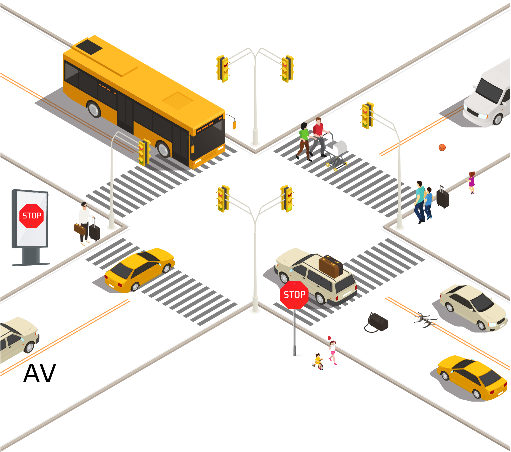
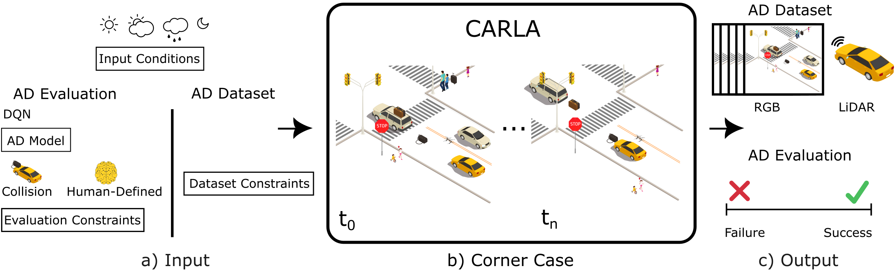
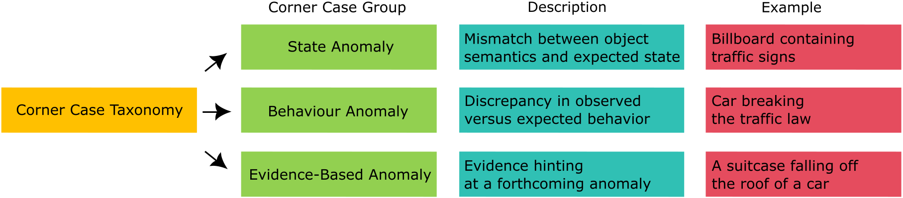
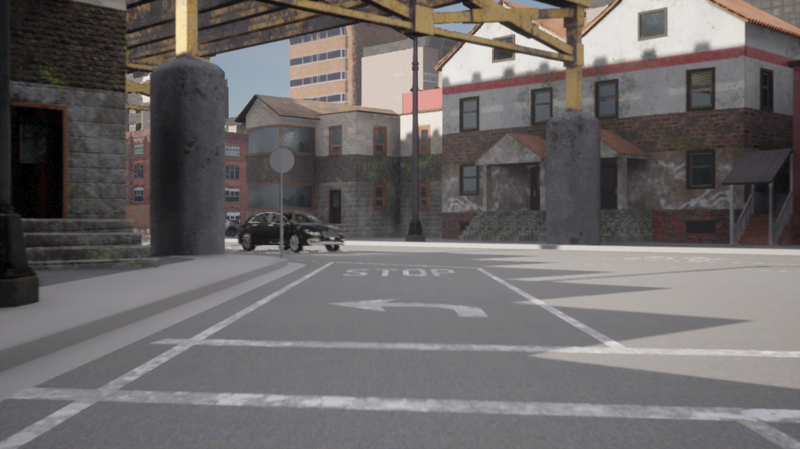
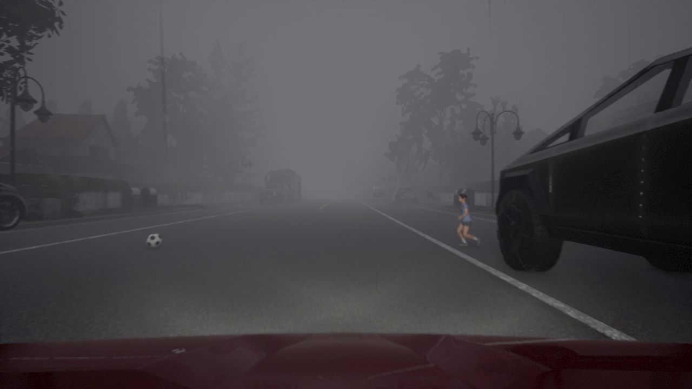

# 3CSim: CARLA Corner Case Simulation for Control Assessment in Autonomous Driving
[[PAPER]](https://arxiv.org/abs/2409.10524) 

### Contribution
I. We propose 3CSim for control assessment of AD models
in controlled and deterministic environment. <br>
II. We propose a taxonomy of advanced corner case scenarios implemented in our proposed simulation.


## Abstract
We present the CARLA corner case simulation (3CSim) for evaluating autonomous driving (AD) systems within the CARLA simulator. 
This framework is designed to address the limitations of traditional AD model training by focusing on non-standard, rare, 
and cognitively challenging scenarios. 
These corner cases are crucial for ensuring vehicle safety and reliability, as they test advanced control capabilities under unusual conditions. 
Our approach introduces a taxonomy of corner cases categorized into state anomalies, behavior anomalies, and evidence-based anomalies. 
We implement 32 unique corner cases with adjustable parameters, including 9 predefined weather conditions, timing, and traffic density. 
The framework enables repeatable and modifiable scenario evaluations, facilitating the creation of a comprehensive dataset for further analysis.

## 0. Corner Cases in the Traffic


Fig. 1. A wide range of corner cases that can arise in real-world traffic
scenarios.

## 1. Carla Corner Case Framework (3CSim)

### 1.1 3CSim

Fig. 2. Overview of the 3CSim framework for AD system evaluation, including a) input configuration, b) corner case-triggered simulation, and c) output as
either scenario assessment or data for further analysis.

### 1.2 Corner Case Taxonomy

Fig. 3. A taxonomy of corner cases categorized into state anomalies, behavior anomalies, and evidence-based anomalies.

### 1.3 State Anomaly

Fig. 4. A STOP sign integrated into an advertisement.

### 1.4 Behavior Anomaly

Fig. 6. An oncoming vehicle is indicating to turn right into one-way street.

### 1.5 Evidence-Based Anomaly


Fig. 7. A soccer ball as an indicator of a child’s imminent entry onto the
road.

## 2. Citation
If you use this code or ideas from the paper for your research, please cite our paper:
```
@misc{cavojsky20243csim,
      title={3CSim: CARLA Corner Case Simulation for Control Assessment in Autonomous Driving}, 
      author={Matúš Čávojský and Eugen Šlapak and Matúš Dopiriak and Gabriel Bugár and Juraj Gazda},
      year={2024},
      eprint={2409.10524},
      archivePrefix={arXiv},
      primaryClass={cs.RO},
      url={https://arxiv.org/abs/2409.10524}, 
}
```